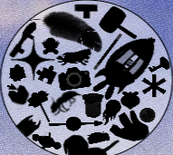

    

<figure>
        
</figure>

## About Zach Horton
I am a recent Game Development graduate from UWE Bristol, with a 2:1 in the Games Technology Bachelors and a Merit in the Commercial Games Development Masters. I'm especially passionate for level design and game mechanics alongside their theory, as well as overall gameplay programming. I have developed these and other prominent areas to further heights, especially in university where I was provided with industry-esque experience and tasks through PlayWest. My time there provided an invaluable experience that affirmed my aspirations and continuously encouraged me to leave my comfort zone, building me up further to be an extremely ambitious, hard-working and creative individual that strives to put their best into any task. Overall, I have loved the industry from a young age and am incredibly keen to make experiences similar to those I've enjoyed over the years, especially through my current independent projects. 

**Current Projects**:

	* "Retro Party Project", a larger scope Unity project in its beginning stages intending to be a casual couch multiplayer experience	
	* SMBX Level Design, showcasing level design and game design/mechanic intensive skills alongside implementation of LUA

**Notably Strong Areas**:

	* Level Design and theory alongside how they intertwine with game mechanics, including player psychology, flow and reward	
	* Unity and C# (2 years of normal experience through Bachelors degree and 1 year of industry-esque experience through the Masters and PlayWest)
	* Problem solving, applied to many areas across the board such as level design, potential game elements and coding itself
	* LUA through SMBX Level Design
	
**Well Versed In With Some Experience Of**:

	* Version Control through GitHub and GitKraken (throughout university and in independent projects)	
	* C++ through a lecturer created 2D game engine (2 years of experience through such)
	
Other areas such as DirectX C++, AIML, UE4, Maya and TensorFlow Python are not as strong due to less experience (a select handful of university modules), however initial experience has been rooted and is able to grow out.