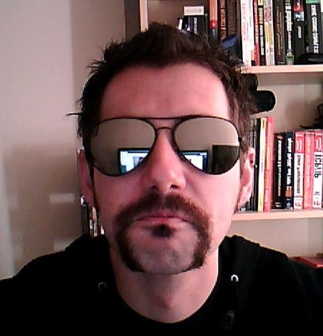

    

<figure>
        
		<figcaption>Da Boss!</figcaption>
</figure>

## About Me
Career started here.. I've obtained these grades. I make games, sometimes I program. Occasionally, there are students, they ask a lot of questions. I do my best. Possibly not selling myself in the best light.

Studied at UWE, on the Games Technology degree. Went on to study my masters at Goldsmiths. Passionate gamer, it's the games that drive me and not the coding.

So, this might be a good place to list a shorthand CV, or even provide a download to one. Plenty of plugins do this. Some even generate HTML into a PDF preformatted CV. Alternatively, you may want to link to linkedin instead.
      
[Contact Me](https://github.com/TaylanTatli/Moon){: .btn}
